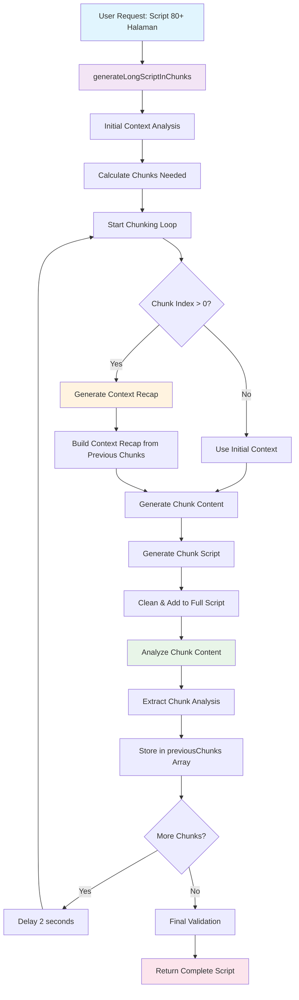

# 🔄 **Alur Kerja Context Recap & Script Analysis**

## 📊 **Diagram Alur Kerja**



## 🔍 **Detail Proses**

### **1. Initial Setup**
```
User Request → Context Analysis → Calculate Chunks → Start Loop
```

### **2. Chunk Generation Loop**
```
For each chunk:
  ├── If chunk > 0: Generate Context Recap
  ├── Generate Chunk Content with Context
  ├── Analyze Chunk Content
  └── Store Analysis for Next Iteration
```

### **3. Context Recap Process**
```
Previous Chunks → Cumulative Analysis → Context Recap → Next Chunk
```

### **4. Chunk Analysis Process**
```
Chunk Content → AI Analysis → Extract Metadata → Store Analysis
```

## 📋 **Data Flow**

### **Input Data**
- User message
- Project context
- Active modes (Style DNA, Knowledge Graph)
- Target pages

### **Processing Data**
- Chunk analysis results
- Context recap
- Cumulative analysis
- Previous chunks data

### **Output Data**
- Complete script
- Chunk analyses
- Context recaps
- Quality metrics

## 🎯 **Key Components**

1. **ChunkAnalysis Interface**: Stores analysis of each chunk
2. **generateContextRecap()**: Creates context recap from previous chunks
3. **analyzeChunkContent()**: Analyzes individual chunk content
4. **Enhanced generateLongScriptInChunks()**: Main orchestrator function

## 🔄 **Iteration Process**

```
Chunk 1: [Generate] → [Analyze] → [Store]
Chunk 2: [Recap from Chunk 1] → [Generate] → [Analyze] → [Store]
Chunk 3: [Recap from Chunks 1-2] → [Generate] → [Analyze] → [Store]
...
Chunk N: [Recap from Chunks 1-N-1] → [Generate] → [Analyze] → [Store]
```

## 📊 **Quality Metrics**

- **Confidence Score**: Per chunk analysis confidence
- **Character Consistency**: Character tracking across chunks
- **Plot Thread Management**: Open threads tracking
- **Tone Consistency**: Emotional tone tracking
- **Transition Quality**: Transition point analysis

## 🚀 **Performance Characteristics**

- **API Calls**: 3x per chunk (generate + analyze + recap)
- **Processing Time**: +3-5 seconds per chunk
- **Memory Usage**: Minimal (only analysis data)
- **Quality Improvement**: Significant continuity improvement
